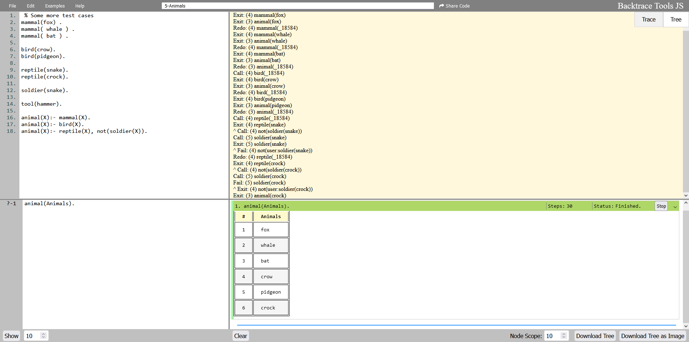
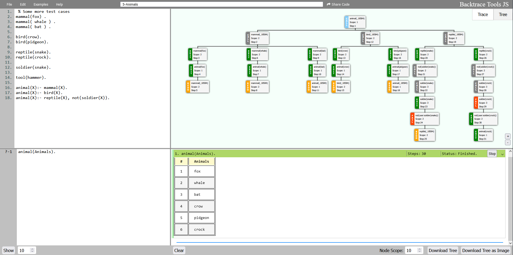
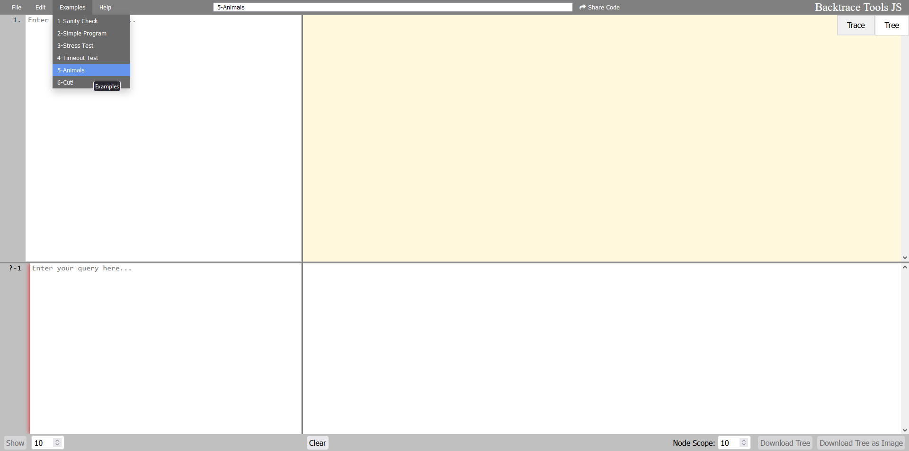
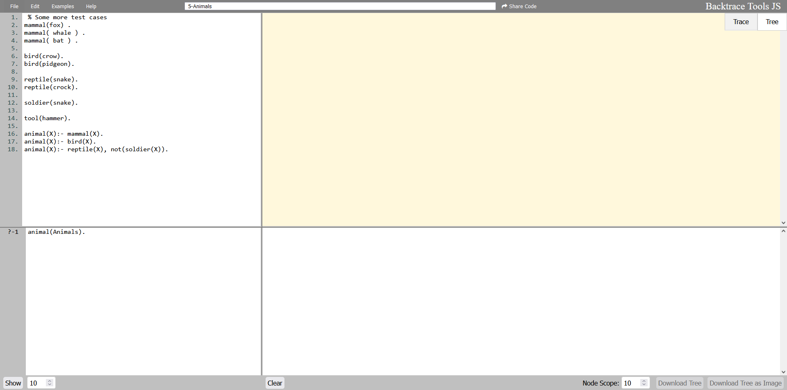
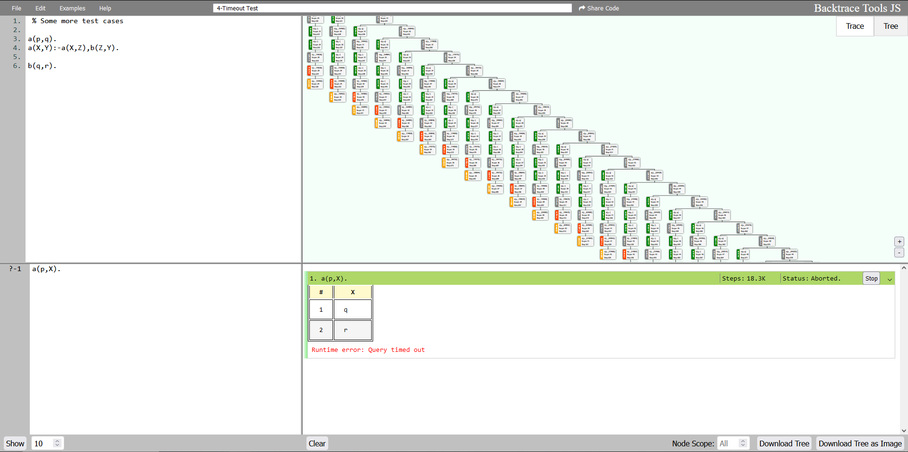
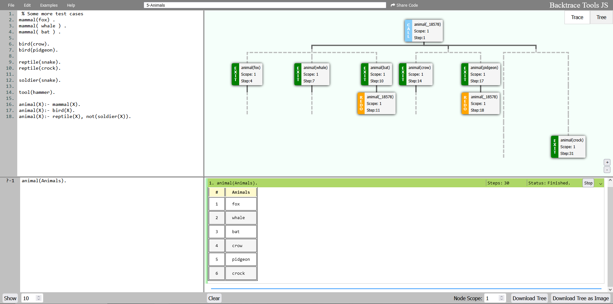
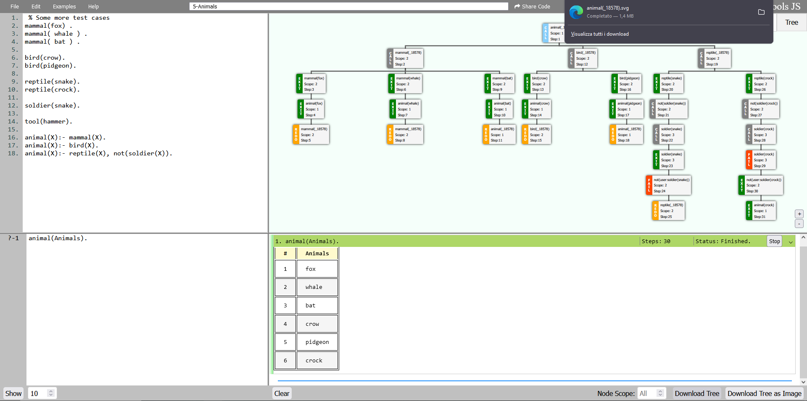
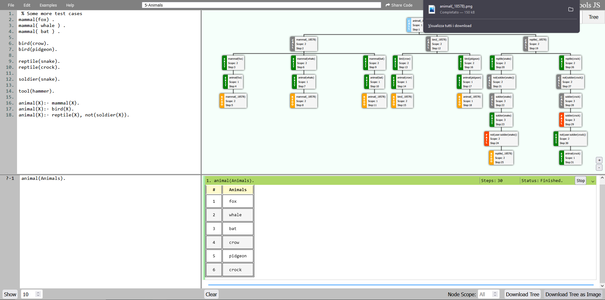

# BacktraceToolsJS

Un interprete PROLOG per browser. Prova la [versione live](https://dogemcdogeface.github.io/BacktraceToolsJS/www/editor/)

<!-- TABLE OF CONTENTS -->

  
Sommario

<ol>
    <li><a href="#informazioni-generali">Informazioni Generali</a></li>
    <li><a href="#tecnologie-utilizzate">Tecnologie Usate</a></li>
    <li><a href="#features">Funzionalità</a></li>
    <li><a href="#utilizzo">Utilizzo</a></li>
    <li><a href="#configurazione">Configurazione</a></li>
    <li><a href="#possibili-miglioramenti">Possibili Miglioramenti</a></li>
    <li><a href="#stato-del-progetto">Stato del Progetto</a></li>
    <li><a href="#riconoscimenti">Riconoscimenti</a></li>
    <li><a href="#contatti">Contatti</a></li>
</ol>

## Informazioni Generali
Questo strumento è un interprete per il linguaggio di programmazione Prolog. Consente agli utenti di scrivere ed eseguire query su programmi Prolog, di tabulare i risultati e di tracciare i passaggi necessari per raggiungere una soluzione, tutto all'interno del browser. A differenza di altri [interpreti online esistenti](https://swish.swi-prolog.org/), questo strumento è interamente integrato nel client, il che significa che tutte le query vengono eseguite sulla macchina dell'utente.
Questo strumento è basato su un port WebAssembly (WASM) di SWI-Prolog ed è progettato per fornire un'interfaccia grafica per l'uso del linguaggio.

## Tecnologie Utilizzate
- [SWI-Prolog](https://www.swi-prolog.org/): Un'implementazione Prolog ampiamente utilizzata.
- [WebAssembly](https://webassembly.org/): Un formato di istruzioni binarie per una virtual machine stack-based.
- [SWI-Prolog for the browser](https://swi-prolog.discourse.group/t/swi-prolog-in-the-browser-using-wasm/5650): Un port WASM di SWI-Prolog.
- [Treant-js](https://fperucic.github.io/treant-js/) Una libreria per disegnare grafi.
- [panzoom library](https://github.com/timmywil/panzoom) Per navigare nel grafico ad albero.
- [html-to-image](https://github.com/bubkoo/html-to-image) Per scaricare l'albero come immagine o SVG.

## Features
- [x] Modifica e interrogazione in tempo reale di programmi Prolog.
- [X] Gli editor di codice hanno tutte le scorciatoie standard, `ctrl-z`/`y`, `ctrl-c`/`x`/`v` ... `Invio` esegue le query.
- [x] Il codice e le query sono persistenti attraverso i caricamenti della pagina. È disponibile anche un insieme di esempi.
- [x] Tabulazione automatica dei risultati, con indicazione se ci sono altri risultati disponibili.
- [X] Tracciamento automatico dei passaggi necessari per raggiungere ogni soluzione.
  - [X] Visualizza i passaggi sotto forma di albero grafico.
  - [X] Possibilità di ingrandire e rimpicciolire l'albero.
  - [X] Filtrare i nodi dell'albero in base al valore dello scope.
  - [X] Scarica l'albero come PNG o SVG.
- [x] Implementare query Prolog multi-threaded.

## Utilizzo
Basta aprire l'[editor](https://dogemcdogeface.github.io/BacktraceToolsJS/www/editor/) nel browser, scrivere il programma Prolog, scrivere la query e premere `Invio`.

Sono forniti alcuni esempi per testare sia la funzionalità che i limiti del tool.

Gli utenti possono selezionare il numero di soluzioni da calcolare e interrompere il processo se necessario.

Per una  maggiore leggibilità e lettura più sintetica dell'albero gli utenti possono selezionare uno scope di riferimento per trascurare i nodi sopra una certa soglia.

È persino possibile scaricare la rappresentazione grafica dell'albero visualizzato in formato svg o png.

## Configurazione
Per avere una versione privata, è necessaria solo la cartella [www/](https://github.com/dogeMcdogeface/BacktraceToolsJS/tree/master/www) per far funzionare l'editor. Nella repository è incluso un semplice File Server in Java, ma non è necessario. Qualsiasi altro server può essere utilizzato; ad esempio la [live version](https://dogemcdogeface.github.io/BacktraceToolsJS/www/editor/) utilizza [Github Pages](https://pages.github.com/) senza alcuna configurazione aggiuntiva.

Se si desidera ricompilare SWI-Prolog per il browser, si prega di leggere la [Wiki](https://swi-prolog.discourse.group/t/swi-prolog-in-the-browser-using-wasm/5650).

## Possibili Miglioramenti
Sebbene l'interfaccia grafica dello strumento sia funzionale, lo sviluppo è stato in gran parte indipendente da reali progetti di Prolog. Si apprezzerebbero i feedback degli utenti esperti di Prolog per migliorare la funzionalità e l'usabilità dello strumento, soprattutto per quanto riguarda gli usi convenzionali di Prolog. Questo editor non è pensato per competere con SWISH, e non offre nemmeno una frazione delle sue funzioni. Tuttavia, la facilità d'uso dello strumento e l'esecuzione locale in tempo reale delle query potrebbero fornire un'alternativa comoda per alcuni utenti che trovano SWISH complicato.

## Riconoscimenti

Riconosciamo il merito delle seguenti persone.
- Molte grazie agli [sviluppatori responsabili](https://swi-prolog.discourse.group/t/wiki-discussion-swi-prolog-in-the-browser-using-wasm/5651) dello sviluppo di Prolog nel browser, e per aver risolto i numerosi problemi che ne derivano.

## Stato del progetto
Stato del progetto: _in corso_.

## Contatti
[Over here.](https://github.com/dogeMcdogeface)

<!-- Optional -->
<!-- ## License -->
<!-- This project is open source and available under the [... License](). -->

<!-- You don't have to include all sections - just the one's relevant to your project -->
