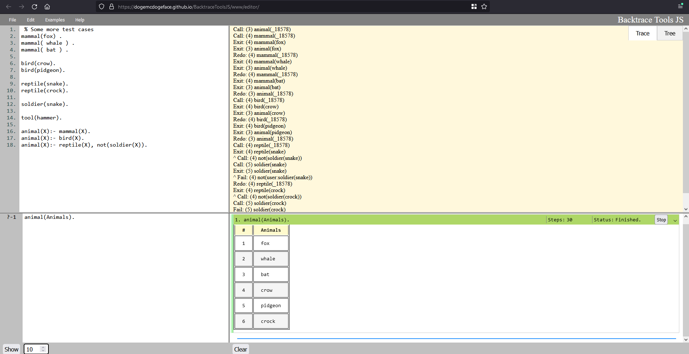
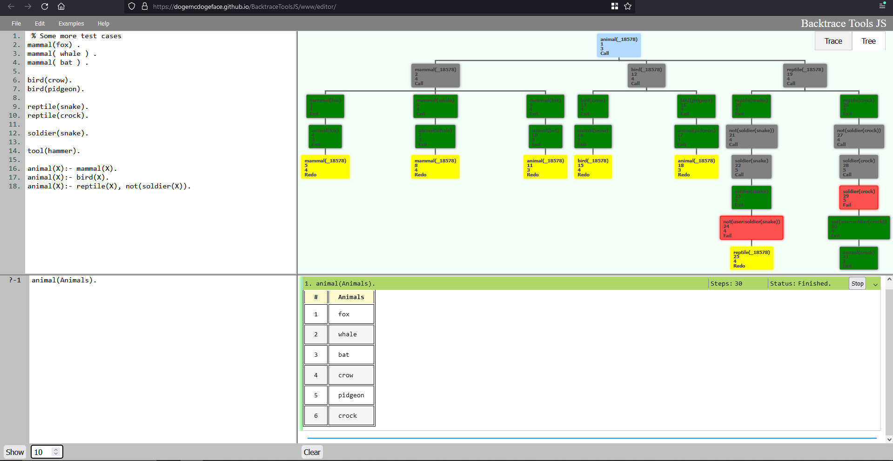

# BacktraceToolsJS

A browser based PROLOG interpreter. Try the [Live version](https://dogemcdogeface.github.io/BacktraceToolsJS/www/editor/)

<!-- TABLE OF CONTENTS -->

  
Table of Contents

<ol>
    <li><a href="#general-information">General Information</a></li>
    <li><a href="#technologies-used">Technologies Used</a></li>
    <li><a href="#features">Features</a></li>
    <li><a href="#usage">Usage</a></li>
    <li><a href="#setup">Setup</a></li>
    <li><a href="#room-for-improvement">Room for Improvement</a></li>
    <li><a href="#acknowledgements">Acknowledgements</a></li>
    <li><a href="#project-status">Project Status</a></li>
    <li><a href="#contacts">Contacts</a></li>
</ol>

## General Information
This tool is a self-contained interpreter for the Prolog programming language. It allows users to write and query Prolog programs, tabulate the results, and trace the steps taken to reach a solution, all from within a browser. Unlike other [existing online interpreters](https://swish.swi-prolog.org/), this tool is entirely client-based, which means that all queries are executed on the user's machine.
This tool is built on top of a WebAssembly (WASM) port of SWI-Prolog, and is designed to provide a Graphical User Interface (GUI) for the language.

## Technologies Used
- [SWI-Prolog](https://www.swi-prolog.org/): A widely-used Prolog implementation.
- [WebAssembly](https://webassembly.org/): A binary instruction format for a stack-based virtual machine.
- [SWI-Prolog for the browser](https://swi-prolog.discourse.group/t/swi-prolog-in-the-browser-using-wasm/5650): A WASM port of SWI-Prolog.
- [Treant-js](https://fperucic.github.io/treant-js/) A graph drawing library.
- [panzoom library](https://github.com/timmywil/panzoom) For navigating the tree chart.

## Features
- [x] Real-time editing and querying of Prolog programs. 
- [X] The code editors have all standard shortcuts, `ctrl-z`/`y`, `ctrl-c`/`x`/`v` ... `Enter` on queries executes them.
- [x] Code and queries are persistent across page reloads. A set of examples are available as well.
- [x] Automatic tabulation of results, with indication of whether more results are available.
- [X] Automatic tracing of the steps taken to reach each solution.
  - [X] Display the steps taken in a graphical tree form.
- [ ] Implement rich text features in the code editors and trace area, such as colored keywords...
- [x] Implement multi-threaded Prolog queries.
- [ ] User file loading and saving.

## Usage
Simply open the [editor](https://dogemcdogeface.github.io/BacktraceToolsJS/www/editor/) in your browser, write your Prolog program, write your query, and press `Enter`. A set of examples is provided for testing both the functionality and limits of the tool. Users can select the number of solutions to compute, and abort the process if necessary.

## Setup
Only the [www/](https://github.com/dogeMcdogeface/BacktraceToolsJS/tree/master/www) folder is required for the editor to work. A simple File Server in Java is included, but not required. Any other server may be used; The [live version](https://dogemcdogeface.github.io/BacktraceToolsJS/www/editor/) for example uses [Github Pages](https://pages.github.com/) with no additional configuration.

If you wish to recompile SWI-Prolog for the browser, please read the [Wiki](https://swi-prolog.discourse.group/t/swi-prolog-in-the-browser-using-wasm/5650).

## Room for Improvement
While the graphical interface of the tool is functional, its development has been largely independent of typical Prolog workflows. Feedback from experienced Prolog users would be appreciated to improve the tool's functionality and usability, especially in regards to conventional Prolog usages. This editor is not intended to compete with SWISH, nor does it offer a fraction of it's functions. However, the tool's ease of use and real-time local execution of queries might provide a convenient alternative for users who find SWISH cumbersome.

## Acknowledgements
Give credit where due.
- Many tanks to the [individuals responsible](https://swi-prolog.discourse.group/t/wiki-discussion-swi-prolog-in-the-browser-using-wasm/5651) for getting Prolog running in the browser, and for troubleshooting the many issues that came with it.

## Project Status
Project is: _in progress_.

## Contacts
[Over here.](https://github.com/dogeMcdogeface)

<!-- Optional -->
<!-- ## License -->
<!-- This project is open source and available under the [... License](). -->

<!-- You don't have to include all sections - just the one's relevant to your project -->
